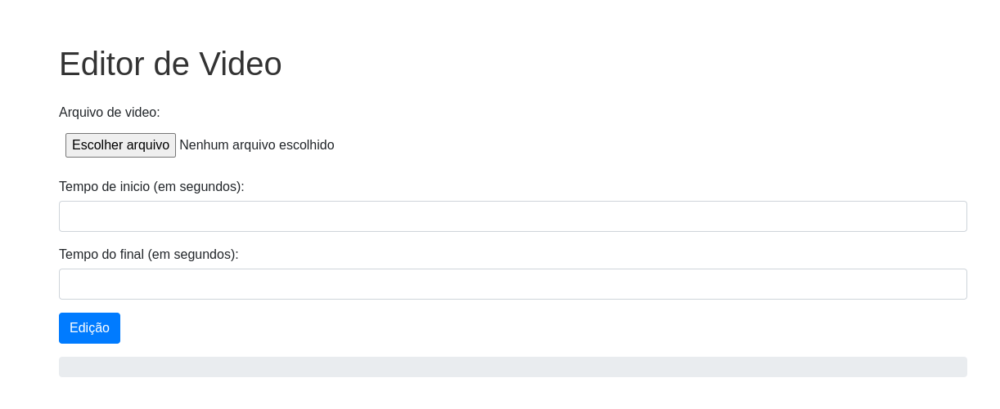

# pyvideo-editor
Simples Web-App criado com FastAPI capaz de editar vídeo

## Rodar o Projeto

```shell
git clone https://github.com/vladetec/pyvideo-editor.git
cd pyvideo-editor
python3 -m venv venv
source venv/bin/activate
pip install -U pip setuptools wheel 
pip install -r requirements.txt
python src/main.py 

```
### Exemplo Visual
